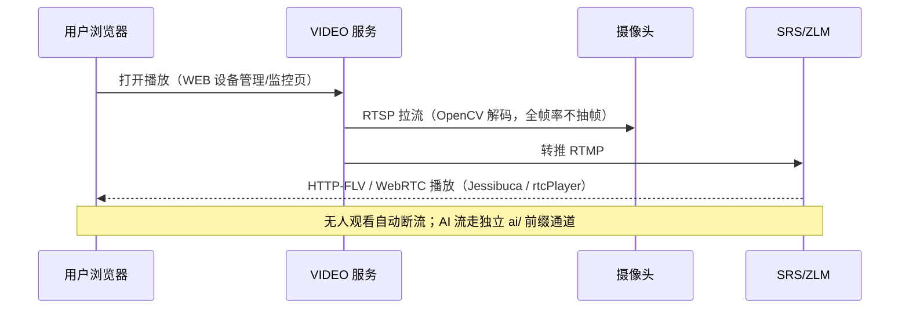
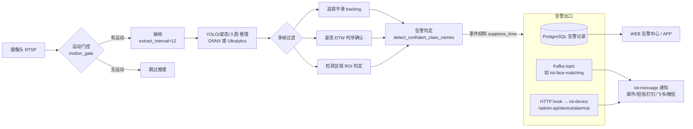
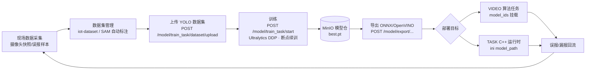
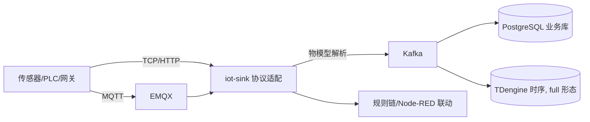
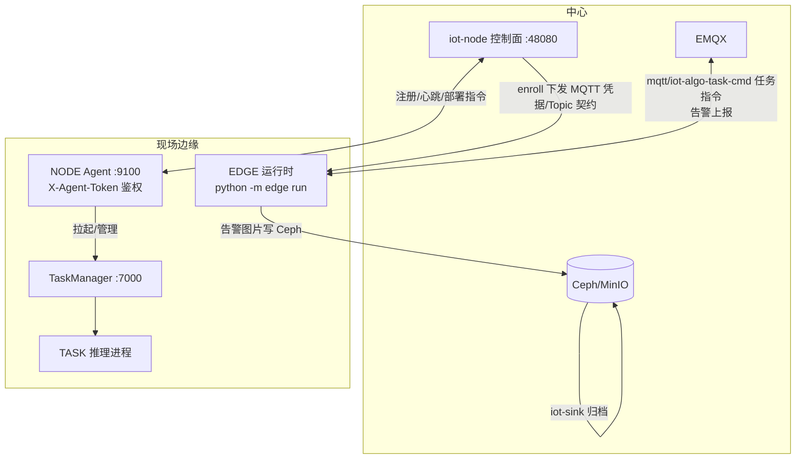

# yFeiEye 整体架构详解

> 整理日期：2026-08-04。本文从"云-边-端"视角梳理 yFeiEye（AIoT 算法应用平台）的整体架构、模块职责、核心数据流与部署形态，附 Mermaid 流程图。同目录 `项目架构设计分析.md`（2026-05-31）侧重技术栈与完成度评估，本文侧重**运行时拓扑与数据流**，两者互补。

---

## 1. 一句话定位

yFeiEye 是一个**云-边-端一体化的 AIoT 平台**：设备/摄像头接入 → 数据采集与实时视频 AI 分析 → 智能研判 → 告警处置 → 模型训练迭代的完整闭环。仓库是 **8 个相互独立项目的 monorepo**，三语混合：Java 做控制底座，Python 做 AI 与流媒体，C++ 做高性能推理。

## 2. 总体架构图

```mermaid
flowchart TB
    subgraph END["端（设备层）"]
        CAM["摄像头<br/>RTSP / ONVIF / GB28181 / NVR"]
        IOT["IoT 设备/传感器<br/>MQTT / TCP / HTTP / Modbus / OPC-UA"]
    end

    subgraph EDGE["边（边缘层）"]
        NODE["NODE 节点 Agent<br/>Python Flask · :9100<br/>注册心跳 / 拉起工作负载"]
        EDGESVC["EDGE 边缘运行时<br/>python -m edge · ~512MB<br/>全 MQTT 总线 / 告警写 Ceph"]
        TASK["TASK 推理引擎<br/>C++17 ONNX Runtime<br/>TaskManager :7000"]
    end

    subgraph CLOUD["云（中心平台）"]
        subgraph FRONT["前端"]
            WEB["WEB 控制台<br/>Vue3+Vite · :8888"]
            APP["APP 移动端<br/>uni-app · :9010"]
            VIS["VISUALIZE 可视化大屏"]
        end

        GW["iot-gateway API 网关<br/>Spring Cloud Gateway · :48080"]

        subgraph JAVA["DEVICE Java 微服务群（Spring Cloud + Nacos）"]
            SYS["iot-system :48099<br/>系统/权限/OAuth2"]
            DEV["iot-device<br/>产品/设备/物模型/OTA"]
            INFRA["iot-infra 基础设施"]
            DS["iot-dataset 数据集"]
            MSG["iot-message 消息推送"]
            FILE["iot-file 文件"]
            SINK["iot-sink 协议接入/数据汇流"]
            GB["iot-gb28181 :48088<br/>国标 SIP 信令"]
            NODESVC["iot-node 节点控制面"]
            TD["iot-tdengine 时序集成"]
        end

        subgraph PY["Python 服务"]
            AI["AI model-server :5000<br/>训练/推理/导出/部署<br/>PyTorch+Ultralytics"]
            VIDEO["VIDEO :6000<br/>摄像头接入/流媒体编排<br/>算法任务/告警/录像"]
        end

        subgraph MW["中间件"]
            NACOS["Nacos :8848"]
            PG[("PostgreSQL 多业务库")]
            REDIS[("Redis")]
            KAFKA[["Kafka"]]
            MINIO[("MinIO :9000/9001")]
            MILVUS[("Milvus 人脸向量库")]
            EMQX[["EMQX MQTT"]]
            SRS["SRS :1935/8080/8000"]
            ZLM["ZLMediaKit :6080 等"]
            TDE[("TDengine 可选")]
        end
    end

    CAM -->|RTSP/GB28181| VIDEO
    CAM -->|GB28181 SIP| GB
    IOT -->|MQTT| EMQX
    EMQX --> SINK
    IOT -->|TCP/HTTP| SINK
    SINK --> KAFKA
    SINK --> PG
    SINK --> TDE

    WEB --> GW
    APP --> GW
    GW --> JAVA
    WEB -.->|直连代理| AI
    WEB -.->|直连代理| VIDEO

    VIDEO <-->|拉流/推流| SRS
    VIDEO <-->|GB 流| ZLM
    VIDEO -->|告警事件/人脸匹配| KAFKA
    VIDEO -->|快照/录像/人脸图| MINIO
    VIDEO -->|人脸向量| MILVUS
    KAFKA --> DEV
    KAFKA --> MSG

    AI <-->|数据集/模型文件| MINIO
    DS -.->|标注数据| AI
    AI -->|ONNX 模型| VIDEO
    AI -->|ONNX 模型| TASK

    NODESVC -->|控制指令/心跳| NODE
    NODE --> TASK
    NODESVC -->|MQTT 凭据/任务契约| EMQX
    EMQX <-->|任务指令/告警| EDGESVC
    EDGESVC -->|告警图| MINIO
```

## 3. 八大模块职责一览

| 模块 | 技术栈 | 定位 | 关键端口 |
|---|---|---|---|
| `WEB/` | Vue 3 + Vite + TS + ant-design-vue + Pinia（pnpm） | PC 管理控制台 | dev 8888 |
| `APP/` | uni-app（unibest）+ Vue 3 + Wot Design Uni | 移动端 H5/小程序/App | dev 9000 / 部署 9010 |
| `DEVICE/` | Java 21 + Spring Boot 2.7 + Spring Cloud 2021 + Nacos | 平台控制底座：设备/产品/物模型、网关、GB28181、消息、数据汇流 | 网关 48080 |
| `AI/` | Python + Flask + PyTorch + Ultralytics/SAM/PaddleOCR | 模型训练/推理/导出/部署（model-server） | 5000 |
| `VIDEO/` | Python + Flask + OpenCV + insightface/pymilvus | 摄像头接入、视频流、算法任务编排、告警、录像 | 6000 |
| `TASK/` | C++17 + CMake + OpenCV/ONNX Runtime/FFmpeg | 单相机推理运行时 + TaskManager 进程管理 | 7000 |
| `NODE/` | Python + Flask | 边缘节点 Agent：注册心跳、拉起负载 | 9100 |
| `EDGE/` | Python + paho-mqtt | 无界面边缘算法运行时，全 MQTT，告警写 Ceph | —（纯 MQTT） |
| `VISUALIZE/` | Vue | 可视化大屏编辑器（仅 full 形态部署） | — |

## 4. 部署形态（三档规格）

由 `EASYAIOT_DEPLOY_PROFILE=mini|standard|full` 控制（`.scripts/docker/deploy_profile.sh`）：

| 形态 | 内存 | 内容 |
|---|---|---|
| **mini** 边缘盒子 | ≥4GB | 仅 iot-system + 必需中间件；**无 Nacos/Gateway**，前端经 nginx 直连 iot-system；Simple Discovery + 静态 Feign URL |
| **standard** AI 一体机 | ≥16GB | 微服务全量 + EMQX；不含 TDengine、APP、VISUALIZE |
| **full** 全栈一体机（默认） | ≥20GB | 全部服务 + TDengine + APP + VISUALIZE |

统一部署入口：`.scripts/docker/install_linux.sh`（先 `install_middleware_linux.sh install` 起中间件，再起业务模块）。

## 5. 核心流程详解

### 5.1 视频观看链路（按需拉流）

要点：观看链路与 AI 链路解耦；WEB 端 Jessibuca（HTTP-FLV，0.8~2s）或 WebRTC（0.3~0.8s）；GB28181 摄像头经 ZLM `rtp_proxy` 出 FLV（1~3s）。

### 5.2 AI 实时分析与告警链路

要点：告警与页面播放完全无关，服务端常驻；人脸识别是"检测(face_det.onnx)+特征(face_rec.onnx)+Milvus 向量比对"，阈值三级覆盖（任务 > 人脸库 > env）；摔倒检测走 YOLO Pose 关键点 + 规则模板/DTW 多帧确认。

### 5.3 模型训练→部署闭环

### 5.4 IoT 设备数据链路

### 5.5 边缘拓扑（NODE / EDGE）

设计约束（`EDGE/README.md`）：EDGE 无界面、全 MQTT（无 Kafka/HTTP 管理面）、边缘零本地业务盘、与 VIDEO 源码解耦；NODE 的 `PLATFORM_AGENT=0` 不可改为 1。

## 6. 端口速查

| 端口 | 服务 | 端口 | 服务 |
|---|---|---|---|
| 8888 | WEB dev | 8848 | Nacos |
| 9000 | APP dev（部署 9010） | 9000/9001 | MinIO API/Console |
| 48080 | API 网关 / iot-node 控制面 | 5432 | PostgreSQL |
| 48088 | iot-gb28181 API | 6379 | Redis |
| 48099 | iot-system | 9092 | Kafka |
| 5000 | AI model-server | 1935/8080/8000 | SRS RTMP/HTTP/WebRTC |
| 6000 | VIDEO | 6080/10935/10000/8001 | ZLM HTTP/RTMP/RTP/WebRTC |
| 7000 | TASK TaskManager | 1883/8883 | EMQX MQTT |
| 9100 | NODE Agent | 6030 | TDengine |

## 7. 关键设计决策与约定

- **观看/分析双链路分离**：页面不开播不影响 AI 告警；AI 流独立 `ai/` 前缀可叠框。
- **告警即事件**：检测→多帧确认（追踪/DTW/ROI/抑制）→ 告警事件 → Kafka/HTTP/通知三出口。司法监管业务的领域术语与合规约束见根目录 `CONTEXT.md` 与 `docs/adr/`（改动事件中心/告警/复测前必读）。
- **训练安全边界**：预训练模型白名单（官方 yolov8/11/26 命名），Web 侧只允许 `.onnx` 流转，防 pickle 反序列化。
- **数据库多库隔离**：PostgreSQL 按业务域分库（`ruoyi-vue-pro20`、`iot-ai20` 等）；VIDEO 迁移为 Flyway 风格带 checksum。
- **无 CI**：测试靠手动（DEVICE `mvn test`、AI/VIDEO pytest、WEB `tsx tests/*.test.ts`）。
- 现状风险：中间件密码明文硬编码于各 compose/yaml（勿扩散）；Spring Boot 2.7 已 EOL。

## 8. 与既有文档的关系

- 技术栈清单与完成度评估：`.doc/架构设计/项目架构设计分析.md`
- 部署操作：`.doc/部署文档/平台部署文档.md`、`.doc/部署文档/部署最佳实践.md`
- 领域术语与合规：`CONTEXT.md`、`docs/adr/`
- 设计工作流（spec/plan）：`docs/superpowers/`
