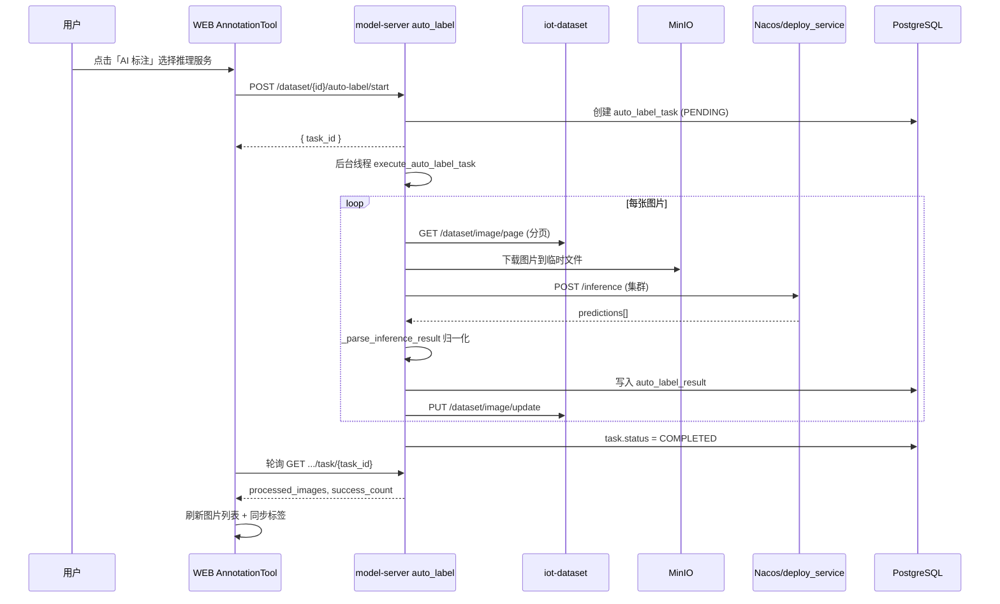

# EasyAIoT 自动化标注 — 详细设计文档

> 版本：1.1.0  
> 更新日期：2026-06-10  
> 所属模块：AI model-server + WEB 数据集标注工具 + iot-dataset  
> 快速说明：见 [AUTO_LABEL_README.md](../AUTO_LABEL_README.md)

---

## 1. 背景与目标

### 1.1 业务背景

在目标检测类模型训练流程中，图像标注是耗时最长的环节。EasyAIoT 将「模型部署 → 集群推理 → 标注写回」整合进统一数据集标注平台，使用户在标注画布中一键对整库图片执行 AI 批量推理，并将结果以与手工标注相同的 JSON 格式持久化，便于后续划分用途、导出 YOLO、同步 Minio 训练。

### 1.2 设计目标

| 目标 | 说明 |
|------|------|
| 统一入口 | 废弃独立 `auto-labeling` 微服务，功能收敛至 `AnnotationTool` |
| 格式一致 | AI 标注与手工标注共用归一化矩形 + `label` 字段 |
| 异步批量 | 大数据集后台线程处理，前端轮询进度 |
| 可运维 | 任务/结果落库，支持失败追溯 |
| 易用引导 | 前端分步提示、空状态引导部署模型 |

### 1.3 非目标（当前版本不做）

- Java `DatasetController.autoLabelDataset()` 空桩接口的实现
- `SettingsModal` 本地 YOLO11 插件管理（未接入）
- 任务暂停/恢复/取消
- COCO / VOC 导出（导出已迁移至 iot-dataset，仅 YOLO）

---

## 2. 系统架构

### 2.1 逻辑架构

```
┌─────────────────────────────────────────────────────────────────────────┐
│  WEB 标注平台 (AnnotationTool)                                          │
│  ├─ AILabelModal        启动批量 AI 标注                                 │
│  ├─ ImportDatasetModal  导入（iot-dataset /annotation/*）                │
│  └─ ExportDatasetModal  导出（iot-dataset /annotation/export）           │
└───────────────────────────────┬─────────────────────────────────────────┘
                                │ HTTP /admin-api/model/dataset/...
                                ▼
┌─────────────────────────────────────────────────────────────────────────┐
│  网关 iot-gateway  →  lb://model-server (AI Flask, 端口见部署配置)       │
│  ├─ auto_label_bp      自动化标注任务编排                                │
│  ├─ deploy_service_bp  推理服务列表（前端选模型）                         │
│  └─ cluster 推理       经 Nacos 发现 deploy 实例                        │
└───────┬─────────────────────────────┬───────────────────────────────────┘
        │ JAVA_BACKEND_URL            │ Nacos + deploy_service
        ▼                             ▼
┌───────────────────┐         ┌──────────────────────┐
│ iot-dataset (Java)│         │ run_deploy.py 推理实例 │
│ 图片元数据 / 标注  │         │ POST /inference       │
└─────────┬─────────┘         └──────────────────────┘
          │
          ▼
┌───────────────────┐         ┌──────────────────────┐
│ MinIO             │         │ PostgreSQL (iot-ai)   │
│ 图片对象存储       │         │ auto_label_task/result│
└───────────────────┘         └──────────────────────┘
```

### 2.2 服务边界

| 职责 | 负责服务 | 说明 |
|------|----------|------|
| 任务编排、推理调用、坐标转换 | AI `auto_label.py` | 核心自动化逻辑 |
| 图片 CRUD、标注持久化 | iot-dataset | `PUT /dataset/image/update` |
| 导入/导出/抽帧 | iot-dataset | `DatasetAnnotationController` |
| 推理执行 | deploy_service 子进程 | ONNX / YOLO `run_deploy.py` |
| 服务发现 | Nacos | `model_{id}_{format}_{version}` |
| 任务状态存储 | AI PostgreSQL | `auto_label_task` / `auto_label_result` |

### 2.3 网关路由

前端请求：`/dev-api/model/dataset/...`  
代理后：`http://gateway:48080/admin-api/model/dataset/...`  
转发至：`lb://model-server`

蓝图注册（`AI/run.py`）：

```python
app.register_blueprint(auto_label.auto_label_bp, url_prefix='/model/dataset')
app.register_blueprint(deploy.deploy_service_bp, url_prefix='/model/deploy_service')
```

---

## 3. 核心流程

### 3.1 批量 AI 标注时序



### 3.2 单张 AI 标注（API 已实现，前端未接入）

```
POST /model/dataset/dataset/{dataset_id}/auto-label/image/{image_id}
Body: { model_service_id, confidence_threshold }
```

同步执行，适用于「当前画布一键推理」场景，可在后续版本接入顶栏按钮。

---

## 4. 数据模型

### 4.1 PostgreSQL（AI 库）

DDL 见 `.scripts/postgresql/iot-ai10.sql`。

#### auto_label_task

| 字段 | 类型 | 说明 |
|------|------|------|
| id | serial PK | 任务 ID |
| dataset_id | bigint | 数据集 ID（对应 Java 库） |
| model_service_id | int FK→ai_service.id | 部署服务 ID |
| status | varchar(20) | PENDING / PROCESSING / COMPLETED / FAILED |
| total_images | int | 待处理总数 |
| processed_images | int | 已处理数 |
| success_count | int | 成功数 |
| failed_count | int | 失败数 |
| confidence_threshold | float | 置信度阈值 |
| error_message | text | 任务级错误 |
| started_at / completed_at | timestamp | 时间戳 |

#### auto_label_result

| 字段 | 类型 | 说明 |
|------|------|------|
| task_id | int FK | 所属任务 |
| dataset_image_id | bigint | 图片 ID |
| annotations | text | 标注 JSON |
| status | SUCCESS / FAILED | 单张结果 |
| error_message | text | 单张错误 |

### 4.2 标注 JSON 格式（写回 Java）

与前端 `AnnotationTool` 手工标注一致：

```json
[
  {
    "label": "person",
    "confidence": 0.87,
    "points": [
      { "x": 0.12, "y": 0.34 },
      { "x": 0.56, "y": 0.34 },
      { "x": 0.56, "y": 0.78 },
      { "x": 0.12, "y": 0.78 }
    ],
    "type": "rectangle",
    "auto": true,
    "color": "#52c41a"
  }
]
```

- 坐标：**归一化** 0~1，相对原图宽高  
- `label`：类别**名称**（与 `class_name` 对应，非 shortcut 数字）  
- `auto: true`：标识 AI 生成，便于 UI 区分  

### 4.3 推理结果输入格式

`ClusterInferenceService` 期望 deploy 实例返回：

```json
{
  "code": 0,
  "data": {
    "predictions": [
      {
        "class": 0,
        "class_name": "person",
        "confidence": 0.87,
        "bbox": [x1, y1, x2, y2]
      }
    ]
  }
}
```

`bbox` 为**像素坐标**，由 `_parse_inference_result` 裁剪并归一化。

---

## 5. API 规格

基础路径：`/admin-api/model/dataset`（网关）或 `/model/dataset`（直连 model-server）

### 5.1 启动批量标注

```
POST /dataset/{dataset_id}/auto-label/start
Content-Type: application/json

{
  "model_service_id": 1,
  "confidence_threshold": 0.5
}
```

| 响应 code | 说明 |
|-----------|------|
| 0 | 成功，`data.task_id` |
| 400 | 未选服务 / 服务未 running |
| 404 | AI 服务不存在 |
| 500 | 服务内部错误 |

实现：`AI/app/blueprints/auto_label.py::start_auto_label`

### 5.2 查询任务状态

```
GET /dataset/{dataset_id}/auto-label/task/{task_id}
```

返回 `to_dict()` 全字段，含 `processed_images`、`success_count`、`failed_count`、`status`。

### 5.3 任务列表

```
GET /dataset/{dataset_id}/auto-label/tasks?page=1&page_size=10
```

### 5.4 单张标注

```
POST /dataset/{dataset_id}/auto-label/image/{image_id}
```

### 5.5 推理服务列表（前端选模型）

```
GET /admin-api/model/deploy_service/list?status=running&pageNo=1&pageSize=100
```

实现：`AI/app/blueprints/deploy.py`，按 `service_name` 聚合副本。

### 5.6 代理类接口（转发 iot-dataset）

| 路径 | 说明 |
|------|------|
| POST `.../auto-label/export` | 转发 `/dataset/{id}/annotation/export` |
| POST `.../extract-frames` | 转发抽帧 |
| POST `.../import-labelme` | 转发 LabelMe 导入 |

> 推荐前端新代码直接使用 `@/api/device/dataset` 中 `/dataset/{id}/annotation/*` 接口。

---

## 6. 后端实现要点

### 6.1 异步任务

- 使用 `threading.Thread(daemon=True)` + Flask `app.app_context()`  
- 每张图片处理后 `commit` 进度，支持前端轮询  
- 单张失败记入 `auto_label_result`，不中断整批任务  

### 6.2 图片拉取

`_fetch_all_dataset_images` 分页调用：

```
GET {JAVA_BACKEND_URL}/admin-api/dataset/image/page
  ?datasetId=&pageNo=&pageSize=1000
```

单页上限与 Java `PageParam.PAGE_SIZE_MAX` 对齐（1000）。

### 6.3 MinIO 路径解析

路径格式：

```
/api/v1/buckets/{bucket}/objects/download?prefix={object_key}
```

由 `_parse_minio_path` 解析后经 `ModelService.download_from_minio` 下载。

### 6.4 集群推理

```python
ClusterInferenceService.inference_via_cluster(
    model_id=ai_service.model_id,
    model_format=ai_service.format or 'onnx',
    model_version=ai_service.model_version or '1.0',
    file_path=temp_file.name,
    parameters={'conf_thres': threshold, 'iou_thres': 0.45},
)
```

依赖 Nacos 注册名：`get_model_service_name(model_id, format, version)`。

### 6.5 写回 Java

```
PUT {JAVA_BACKEND_URL}/admin-api/dataset/image/update
{
  "id": image_id,
  "datasetId": dataset_id,
  "annotations": "<JSON string>",
  "completed": 1 | 0
}
```

注意：Java VO 高度字段名为 `heigh`（历史拼写），批量任务以 PIL 读取实际尺寸为准。

---

## 7. 前端设计

### 7.1 页面结构

| 组件 | 路径 | 职责 |
|------|------|------|
| AnnotationTool | `dataset/components/AnnotationTool/index.vue` | 主标注画布 |
| AILabelModal | `AutoLabel/AILabelModal/index.vue` | 批量 AI 配置弹窗 |
| ImportDatasetModal | `AutoLabel/ImportDatasetModal/index.vue` | 多格式导入 |
| ExportDatasetModal | `AutoLabel/ExportDatasetModal/index.vue` | YOLO 导出 |
| AnnotationWorkflowBar | 工作流四步：导入→标注→划分→同步 |
| AnnotationProgressStrip | 进度条 + 情境化引导文案 |

API 封装：`WEB/src/api/device/auto-label.ts`

### 7.2 用户动线（推荐）

```
1. 数据集详情 → 进入标注工具
2. 「添加」→ 导入图片 / 上传 / 抽帧
3. 训练中心 → 模型部署 → 部署并启动推理服务（status=running）
4. 标注工具顶栏 → 「AI 标注」→ 选择服务 → 开启
5. 等待顶栏进度提示完成 → 检查画布标注框
6. 必要时在标签面板确认类别已同步
7. 工作流 → 划分用途 → 同步 Minio → 导出 / 训练
```

### 7.3 易用性设计要点

| 设计点 | 实现 |
|--------|------|
| 前置条件可见 | 弹窗内三步引导 Alert |
| 无推理服务空状态 | 提示前往 `/train?tab=4` 模型部署 |
| 批量进度反馈 | 顶栏显示 `已处理/总数` + 成功/失败数 |
| 工作流提示 | 待标注时推荐 AI 批量标注入口 |
| 标签同步 | 任务完成后 `syncTagsFromImport` 扫描创建标签 |
| AI 按钮视觉区分 | 橙色样式 `ai-batch-btn` |

### 7.4 轮询策略

- 间隔：2500ms  
- 终止条件：`COMPLETED` / `FAILED` / 请求异常  
- 完成后：刷新图片列表、同步标签、刷新 syncCheck  

### 7.5 已知前端局限

| 项 | 状态 |
|----|------|
| 单张画布 AI 推理按钮 | 未实现（API 已有） |
| 任务历史列表 UI | 未实现（API 已有） |
| 批量任务取消 | 未实现 |
| SettingsModal (YOLO11) | 未接入 |

---

## 8. 部署与配置

### 8.1 环境变量（AI / model-server）

```bash
# Java 网关或 dataset 根地址（用于拉取/更新图片）
JAVA_BACKEND_URL=http://iot-gateway:48080

# Nacos（集群推理发现）
NACOS_SERVER_ADDR=...

# PostgreSQL（auto_label 表）
DATABASE_URL=postgresql://...

# MinIO（与 ModelService 一致）
MINIO_ENDPOINT=...
```

### 8.2 前置检查清单

- [ ] model-server 已注册 Nacos，网关 `/admin-api/model/**` 可达  
- [ ] PostgreSQL 已执行 `iot-ai10.sql` 或 `db.create_all()`  
- [ ] 至少一个 `ai_service.status = running`  
- [ ] 对应模型实例已在 Nacos 注册且 `/inference` 正常  
- [ ] `JAVA_BACKEND_URL` 从 AI 容器内可访问 dataset 接口  
- [ ] MinIO 桶与图片 `path` 字段可下载  

### 8.3 故障排查

| 现象 | 可能原因 | 处理 |
|------|----------|------|
| 下拉无模型 | 无 running 部署服务 | 训练中心 → 模型部署 → 启动 |
| 启动报 AI 服务不存在 | ID 无效或已删除 | 重新部署 |
| 启动报服务未运行 | status≠running | 启动副本 |
| 任务 FAILED：未找到模型服务实例 | Nacos 未注册 | 检查 deploy 心跳与 Nacos |
| 任务完成但无框 | 置信度过高 / 模型类别不匹配 | 降低阈值 |
| 有框但显示「未知标签」 | 标签未创建 | 完成后自动 syncTags；或手动添加标签 |
| 更新图片失败 | JAVA_BACKEND_URL 错误 | 修正环境变量 |

---

## 9. 安全与权限

- 前端请求携带 `X-Authorization: Bearer {jwt}`  
- AI → Java 内部调用：iot-dataset `SecurityConfiguration` 对 `PREFIX/**` 为 `permitAll`（内网信任）  
- 生产环境建议：AI 服务使用服务间 Token 或走内部网关  

---

## 10. 性能与扩展

### 10.1 当前性能特征

- 单线程顺序处理图片（简单可靠）  
- 每图一次 HTTP 推理 + 两次 Java API（读列表已批量）  
- 大数据集（>5000 张）耗时长，无断点续跑  

### 10.2 演进建议

1. **任务队列化**：Celery / Redis 队列 + 并发 worker  
2. **批量推理**：多图 batch 送入 GPU  
3. **任务取消**：`POST /task/{id}/cancel` + 线程 Event  
4. **单张画布 AI**：顶栏按钮调用 `labelSingleImage`  
5. **写回时同步标签**：Java `updateDatasetImage` 调用 `syncTagsFromAnnotations`  
6. **置信度按类别**：per-class threshold  

---

## 11. 测试建议

### 11.1 接口测试

```bash
# 服务列表
curl "http://localhost:48080/admin-api/model/deploy_service/list?status=running"

# 启动任务
curl -X POST "http://localhost:48080/admin-api/model/dataset/dataset/3/auto-label/start" \
  -H "Content-Type: application/json" \
  -d '{"model_service_id":1,"confidence_threshold":0.5}'

# 轮询状态
curl "http://localhost:48080/admin-api/model/dataset/dataset/3/auto-label/task/1"
```

### 11.2 端到端验收

1. 导入 ≥10 张测试图  
2. 部署 person 检测模型并启动  
3. 执行 AI 批量标注，观察顶栏进度  
4. 随机抽查 3 张：框位置、类别名、completed 状态  
5. 确认标签面板已有所需类别  
6. 导出 YOLO ZIP 验证 labels 目录  

---

## 12. 文档与代码索引

| 类型 | 路径 |
|------|------|
| 后端蓝图 | `AI/app/blueprints/auto_label.py` |
| 集群推理 | `AI/app/blueprints/cluster_inference_service.py` |
| 数据模型 | `AI/db_models.py` |
| 推理实例 | `AI/services/ai_service/run_deploy.py` |
| 前端 API | `WEB/src/api/device/auto-label.ts` |
| 标注主界面 | `WEB/src/views/dataset/components/AnnotationTool/index.vue` |
| AI 弹窗 | `WEB/src/views/dataset/components/AutoLabel/AILabelModal/index.vue` |
| 导入导出 API | `WEB/src/api/device/dataset.ts` |
| SQL | `.scripts/postgresql/iot-ai10.sql` |

---

## 附录 A：与旧方案对比

| 项目 | 旧独立 auto-labeling (8000) | 当前方案 |
|------|----------------------------|----------|
| 入口 | 独立 Tab | 统一 AnnotationTool |
| 导出 | auto_label export | iot-dataset annotation/export |
| 部署 | 额外容器 | 复用 model-server |
| Java auto-label 桩 | 无 | 存在但未使用 |

## 附录 B：状态机

```
PENDING → PROCESSING → COMPLETED
                    ↘ FAILED
```

单张结果：`SUCCESS` / `FAILED`（不影响任务继续）
