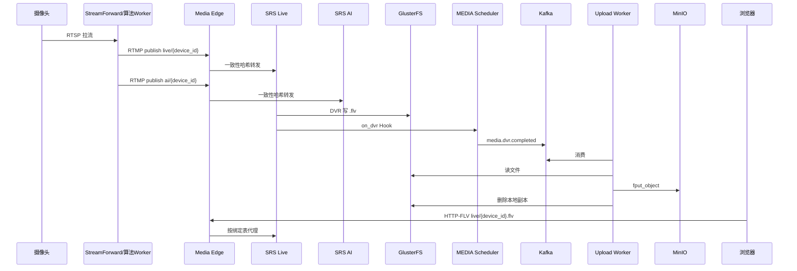
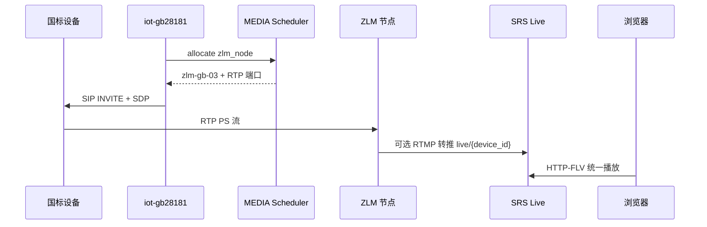

# 架构与网络设计

## 1. 设计原则

| 原则 | 说明 |
|------|------|
| **控制面与数据面分离** | 信令/调度走 HTTP+Redis；音视频走 UDP/TCP 媒体平面 |
| **Sticky 绑定** | 同一 `device_id` 固定 SRS 节点，避免 DVR 路径与播放漂移 |
| **缓冲与归档分离** | GlusterFS 只缓冲小时级；MinIO 为权威对象存储 |
| **Hook 轻量化** | SRS/ZLM Hook 仅校验+入队，重逻辑在 Worker |
| **可独立扩容** | Media / Business / Storage 三类集群互不影响扩缩 |

## 2. 物理拓扑（20,000 路参考）

```
                         [ Internet / 专网 ]
                                 │
                    ┌────────────┴────────────┐
                    │   SLB / Media Edge ×2~4  │  VLAN10 接入层
                    │   stream-play / ingest   │
                    └────────────┬────────────┘
         ┌───────────────────────┼───────────────────────┐
         │                       │                       │
  ┌──────▼──────┐        ┌───────▼───────┐       ┌───────▼───────┐
  │ SRS Live×16 │        │  SRS AI ×12   │       │  ZLM GB ×12   │  VLAN20 媒体层
  │ 1935/8080   │        │  1935/8080    │       │ 6080/RTP池    │
  └──────┬──────┘        └───────┬───────┘       └───────┬───────┘
         │                       │                       │
         └───────────────────────┼───────────────────────┘
                                 │ 万兆
                    ┌────────────▼────────────┐
                    │  GlusterFS Brick ×6~9    │  VLAN30 存储缓冲层
                    │  gv-playbacks / gv-snaps │
                    └────────────┬────────────┘
                                 │
         ┌───────────────────────┼───────────────────────┐
         │                       │                       │
  ┌──────▼──────┐        ┌───────▼───────┐       ┌───────▼───────┐
  │ Upload      │        │ MinIO ×4~8    │       │ Kafka ×3      │
  │ Worker ×10  │        │ Erasure Code  │       │               │
  └─────────────┘        └───────────────┘       └───────────────┘

  ┌─────────────────────────────────────────────────────────────┐
  │ Business Cluster (VLAN40)                                    │
  │  iot-gateway | VIDEO×N | AI×N | iot-gb28181×N | WEB×N       │
  │  MEDIA-scheduler×3 | PostgreSQL | Redis | Nacos             │
  └─────────────────────────────────────────────────────────────┘
```

## 3. 逻辑数据流

### 3.1 RTSP/ONVIF 直连摄像头（观看 + 算法）



### 3.2 GB28181 国标设备



## 4. 网络平面规划

| VLAN | 网段示例 | 用途 | 带宽 |
|------|----------|------|------|
| VLAN10 | 10.10.10.0/24 | 接入层 SLB、公网映射 | 10G |
| VLAN20 | 10.10.20.0/22 | SRS/ZLM 媒体节点 | 25G 推荐 |
| VLAN30 | 10.10.30.0/24 | GlusterFS、MinIO | 10G+ |
| VLAN40 | 10.10.40.0/24 | 业务微服务、DB、Kafka | 10G |
| VLAN50 | 192.168.0.0/16 | 摄像头接入网（各地接入） | 视现场 |

## 5. DNS 与域名

| 域名 | 指向 | 用途 |
|------|------|------|
| `stream-play.example.com` | Media Edge VIP | HTTP-FLV / WebRTC 播放 |
| `stream-ingest.example.com` | Media Edge VIP | RTMP 推流入口 |
| `media-api.internal` | MEDIA Scheduler LB | 内部 API |
| `minio.internal` | MinIO LB | 对象上传/下载 |
| `kafka.internal` | Kafka brokers | 消息队列 |

## 6. 端口清单

### 6.1 对外（经 Edge 暴露）

| 端口 | 协议 | 服务 | 说明 |
|------|------|------|------|
| 443 | TCP | Nginx | HTTPS 播放、API |
| 1935 | TCP | RTMP | 推流（内网/专线为主） |
| 8000/UDP | UDP | WebRTC | SRS rtc_server |

### 6.2 SRS 单节点（host 网络）

| 端口 | 用途 |
|------|------|
| 1935 | RTMP |
| 8080 | HTTP-FLV |
| 1985 | HTTP API |
| 8000 | WebRTC |

### 6.3 ZLM 单节点

| 端口 | 用途 |
|------|------|
| 6080→80 | HTTP API / FLV |
| 10935 | RTMP |
| 5540 | RTSP |
| 30000-30500 | RTP 多端口 |

### 6.4 内部服务

| 端口 | 服务 |
|------|------|
| 8090 | MEDIA Scheduler |
| 9092 | Kafka |
| 9000 | MinIO API |
| 48080 | iot-gateway |

## 7. Media Edge 路由规则

### 7.1 HTTP 七层（播放）

- `/live/{device_id}.flv` → 查绑定表 → `http://{srs_live_host}:8080/live/{device_id}.flv`
- `/ai/{device_id}.flv` → `http://{srs_ai_host}:8080/ai/{device_id}.flv`
- `/webrtc/` → 对应节点 SRS RTC API

### 7.2 RTMP 四层（推流）

使用 Nginx `stream` 模块 + `hash $remote_addr$arg_name consistent` 或基于 **预分配绑定 IP 直连**（推荐生产：推流 URL 带节点 IP，不经四层 LB，减少 RTMP 协议问题）。

**推荐策略**：

- **推流**：`rtmp://{srs_node_ip}:1935/live/{id}`（Scheduler 分配后直接连节点）
- **播放**：统一走 `stream-play.example.com`（七层反代）

## 8. 带宽容量核算

### 8.1 输入侧（摄像头 → 平台）

假设 20,000 路注册，峰值 30% 同时在线 = 6,000 路：

| 类型 | 路数 | 单路码率 | 小计 |
|------|------|----------|------|
| 观看流 live | 4,000 | 6.5 Mbps | 26 Gbps |
| 算法流 ai | 4,000 | 3.5 Mbps | 14 Gbps |
| 国标 RTP | 2,000 | 4 Mbps | 8 Gbps |
| **合计** | — | — | **~48 Gbps** |

建议媒体层 **≥6×25G 上联** 或等价冗余。

### 8.2 GlusterFS 写入

DVR 30s 分段，20% 设备常录 = 4,000 路：

- 每路 6.5 Mbps × 30s ≈ 24 MB/段
- 4,000 / 30 ≈ **133 段/秒**
- 写入吞吐 ≈ **3.2 GB/s 峰值**（需 NVMe 缓冲 brick + 快速 Upload 删文件）

### 8.3 MinIO 持久化

同上 133 段/秒 × 86400 ≈ **11.5M 对象/天**（若全天常录）；实际按告警录像/计划录像比例通常 **1/10~1/5**。

## 9. 与现网 EasyAIoT 映射

| 现网组件 | 集群化后位置 |
|----------|--------------|
| `.scripts/docker/docker-compose.yml` SRS | 独立 media 节点池，移出 business compose |
| `.scripts/docker/docker-compose.yml` ZLM | 独立 zlm 节点池 |
| `camera_service._default_stream_urls` | 改调 MEDIA `/urls/*` |
| `camera.py on_dvr` | 迁至 Upload Worker |
| WVP `MediaServer` | 与 MEDIA 节点表同步 |
| `WEB/conf/nginx.conf` srs-host | 改 media-edge upstream |

## 10. 部署形态选型

| 形态 | 适用 | 优缺点 |
|------|------|--------|
| **裸机 + systemd** | 2 万路生产 | 性能最佳，运维成本高 |
| **Docker host 网络** | 与现网一致 | SRS 推荐，迁移成本低 |
| **K8s + hostNetwork** | 有 K8s 团队 | 调度方便，网络配置复杂 |
| **K8s + Macvlan** | 多租户 | 隔离好，需 CNI 支持 |

**本方案默认**：SRS 用 **Docker host 网络**（与现网 `.scripts/docker/docker-compose.yml` 一致）；MEDIA / Upload Worker 可 K8s Deployment。
